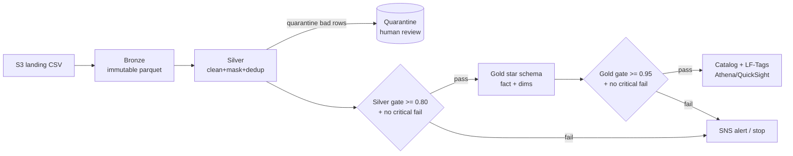

# ADOP Client Demo — two workloads, one pattern

A **complete, runnable, self-contained** worked example of the ADOP (Agentic Data
Onboarding Platform) pattern, built to present to clients: *"If you have Data
Engineering work, here's how the agentic pattern benefits you, what you get, how much
time and cost it saves, and how it drops into your existing AWS + CI/CD."*

Everything here is synthetic. Nothing touches any real/regulated account.

> New to the story? Read [`docs/CLIENT_PITCH.md`](docs/CLIENT_PITCH.md) first.
> Presenting? Open [`docs/presentations/adop-client-deck.html`](docs/presentations/adop-client-deck.html)
> (arrow keys) or print [`docs/presentations/adop-one-pager.html`](docs/presentations/adop-one-pager.html).
> Building on this / reviewing the design? Read [`docs/ARCHITECTURE.md`](docs/ARCHITECTURE.md)
> — sequence diagram, Glue job/Lambda inventory, IaC module structure, packaging.

---

## TL;DR — run the demos locally

```bash
pip install -r requirements.txt
python demo/data_generators/generate_advisory_transactions.py
python workloads/advisory_transactions/scripts/run_local_pipeline.py   # SOX / wealth
python demo/data_generators/generate_web_events.py
python workloads/web_events/scripts/run_local_pipeline.py              # GDPR / clickstream
pytest workloads/ -v
```

The pipeline prints status boxes per phase, quarantines the seeded bad rows,
passes both SOX quality gates, and writes zone outputs to `output/`.

---

## The use cases

| | `advisory_transactions` | `web_events` |
|---|---|---|
| Domain | Wealth / brokerage | Digital analytics |
| Landing | Daily CSV | Hourly JSONL (Kinesis-shaped) |
| Regulation | SOX | GDPR |
| Gold | Star schema | Hourly rollup + erasure index |
| Signature control | Quarantine broken financial math | Suppress no-consent; erase by hashed user |

Daily brokerage/advisory transactions for a wealth-management firm land as a CSV in
S3. We onboard them into a governed medallion lake:

- **Bronze** raw & immutable → **Silver** cleaned, masked, quarantined → **Gold** star schema
- **SOX** compliance: financial-integrity checks, PII masking/suppression, 7-yr retention, audit
- **Step Functions + EventBridge** orchestration (no always-on MWAA cost)
- **GitHub Actions** CI/CD, **Terraform** IaC



---

## Walkthrough — every step, so you can review

Each ADOP agent produces specific artifacts. Here is what was generated and where to
look, in the order the framework runs.

### Step 0 — Cost/tooling setup (you do once)
- `requirements.txt` — local deps. Orchestration is Step Functions (no MWAA) and IaC
  ships a **$25 budget alert** (`iac/terraform/main.tf`).

### Step 1 — Metadata Agent → the spec (`config/`)
The declarative "source of truth" any auditor can read:
- `config/source.yaml` — where data lives, cadence, zones, SOX/retention.
- `config/semantic.yaml` — column roles (identifier/dimension/measure/temporal),
  PII flags, hierarchies, FK relationships. Feeds the Semantic Layer / SageMaker Catalog.

### Step 2 — Transformation Agent → ETL (`scripts/transform/`, `config/transformations.yaml`, `sql/`)
- `config/transformations.yaml` — dedup, casts, string ops, **PII masking**,
  **quarantine rules**, and the Gold **star schema** definition.
- `scripts/transform/local_runner.py` — the pure-pandas transformation core (testable,
  runs anywhere). **Prod PySpark and local mode read the same config**, so they can't drift.
- `scripts/transform/bronze_to_silver.py` / `silver_to_gold.py` — Glue/PySpark
  production entrypoints with a `--local` demo mode.
- `sql/{bronze,silver,gold}/*.sql` — Athena/Iceberg DDL per zone.

### Step 3 — Quality Agent → gates (`config/quality_rules.yaml`, `shared/utils/quality.py`)
- 12 rules across 5 dimensions. **SOX financial-integrity checks are critical**:
  `gross = qty*price` and `net = gross - commission - fees`. Any critical failure
  blocks promotion regardless of overall score. Silver >= 0.80, Gold >= 0.95.

### Step 4 — Orchestration Agent → pipeline (`orchestration/`)
- `<workload>_state_machine.json` — Step Functions ASL. For
  `advisory_transactions` the live path is ingest → silver → silver gate →
  gold → gold gate → register catalog → **Redshift Spectrum → OpenSearch →
  Redis** → verify → succeed (`ResultPath: null` so Glue output does not
  wipe the input). `web_events` still uses the shorter catalog→verify tail
  and is Terraform-disabled in the sandbox. See `docs/ARCHITECTURE.md`.
- `eventbridge_schedule.json` — advisory_transactions daily 07:00 UTC,
  web_events hourly :05 (replaces Airflow/MWAA).

### Step 5 — Load / Governance (`scripts/load/register_catalog.py`)
- Registers Iceberg tables; plans **and applies** (via boto3) Lake Formation
  **LF-Tags** on PII columns (TBAC), scoped per-workload to the columns that
  actually exist. Gold **suppresses** the PII columns entirely (SSN/email/name
  for advisory_transactions; email/IP for web_events). Also the Lambda
  handler behind the `RegisterCatalog` orchestration step.

### Step 6 — DevOps Agent → IaC + CI/CD (`iac/terraform/`, `.github/workflows/`)
- `iac/terraform/main.tf` — a reusable `workload_pipeline` module instantiated
  once per workload: zone-scoped KMS (rotation on), Glue DB, **5 `aws_glue_job`
  + 2 `aws_lambda_function` per workload (10 + 4 total)**, Step Functions,
  EventBridge, SNS, least-privilege IAM, plus one shared budget alert. See
  `APPLY_GUIDE.md` and `docs/ARCHITECTURE.md#7-infrastructure-as-code`.
- `.github/workflows/ci.yml` — tests + config/ASL/Terraform validation on every PR.
- `.github/workflows/deploy.yml` — OIDC (no static keys) → syncs Glue scripts +
  builds/uploads lean Lambda zips → gated `terraform apply` → mandatory
  post-deploy verification for both workloads.

### Step 7 — Tests + Memory (`tests/`, `memory/`)
- `tests/unit/*` + `tests/integration/*` — 28 passing tests across both
  workloads, no AWS required.
- `memory/MEMORY.md` — persistent learnings for faster future runs.

---

## Repository map

```
ADOP/
├── README.md                     <- you are here (walkthrough)
├── ADOP_Pilot_Plan.md            <- the original pilot plan
├── requirements.txt
├── conftest.py
├── demo/
│   ├── data_generators/          <- synthetic CSV generator (with seeded bad rows)
│   └── sample_data/              <- generated advisory_transactions.csv
├── shared/utils/                 <- reusable engine: pii.py, quality.py, verifier
├── workloads/advisory_transactions/
│   ├── config/                   <- source/semantic/transformations/quality/schedule YAML
│   ├── scripts/                  <- extract, transform (+local_runner), quality, load, driver
│   ├── sql/                      <- Bronze/Silver/Gold DDL
│   ├── orchestration/            <- Step Functions ASL + EventBridge schedule
│   ├── tests/                    <- unit + integration
│   ├── memory/                   <- persistent learnings
│   └── README.md
├── workloads/web_events/         <- GDPR contrast (hourly JSONL, consent, erasure)
├── iac/terraform/                <- root + modules/workload_pipeline/ (KMS, Glue jobs, Lambdas, SFN, EventBridge, SNS, IAM, budget)
│   └── modules/                  <- + redshift_workload/, opensearch_workload/, redis_workload/ (extension, advisory_transactions only)
├── .github/workflows/            <- ci.yml + deploy.yml
└── docs/
    ├── ARCHITECTURE.md           <- build/review reference: diagrams, job inventory, IaC, packaging
    ├── CLIENT_PITCH.md           <- the narrative to present
    ├── BEFORE_AFTER.md           <- time & cost tables
    ├── AWS_CICD_FIT.md           <- how it drops into their estate
    ├── ADAPTATION_GAP.md         <- the scoped consulting backlog
    ├── PHASE3_SANDBOX_DEPLOY.md  <- sandbox deploy notes (Phases 0–5 done; see STATUS.md)
    ├── STATUS.md                 <- phase checklist + leftover work
    ├── DEMO_RUNBOOK.md           <- from-scratch time, keep vs destroy for a client demo
    ├── PILOT_FAILURES_AND_FIXES.md <- categorized AWS failures and fixes
    ├── EXTENDING_TO_NEW_SERVICES.md <- how Redshift/OpenSearch/Redis were bolted on; the generalizable recipe
    ├── diagrams/adop-architecture.png
    └── presentations/            <- HTML slide deck + print one-pager
```

---

## Presenting this to a client (suggested flow)

1. **Frame** with the [HTML deck](docs/presentations/adop-client-deck.html) or `docs/CLIENT_PITCH.md`.
2. **Run it live** — SOX pipeline (quarantined bad math) then GDPR pipeline (no-consent suppressed).
3. **Show the artifacts** — configs, SQL, Step Functions ASL, Terraform, GitHub Actions.
4. **Quantify** with `docs/BEFORE_AFTER.md` (~90–95% time, ~$1–4 tokens/workload).
5. **Fit** with `docs/AWS_CICD_FIT.md`.
6. **Close** with `docs/ADAPTATION_GAP.md`. If someone asks “does it run on AWS?”,
   show Step Functions execution `phase3-extensions-3` and `docs/STATUS.md`.
   Demo timing / what to leave running overnight: `docs/DEMO_RUNBOOK.md`.
