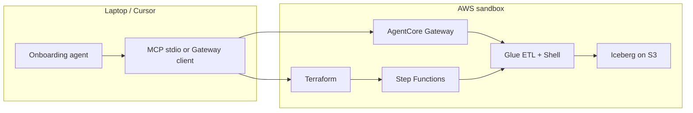
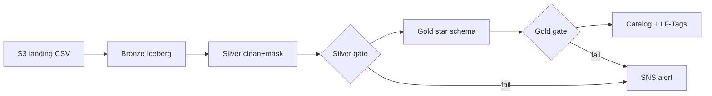

# ai-agentic-data-onboarding

**Agentic Data Engineering accelerator** — spec-driven medallion pipelines on AWS (Iceberg,
Step Functions, Terraform) with an **MCP + AgentCore** agent layer for discovery, deploy, and
sandbox lifecycle.

Built as a Perficient **Data Engineering** offering: show clients how agentic onboarding
reduces time-to-lake while keeping governance, codegen drift checks, and IaC as the source of
truth for production paths.

> **Corporate repo:** [Perficient-Corporate/ai-agentic-data-onboarding](https://github.com/Perficient-Corporate/ai-agentic-data-onboarding)

Synthetic demo data only. Do not point at regulated production accounts without adaptation.

---

## What you get

| Layer | What it does |
|-------|----------------|
| **Specs** | YAML in `workloads/*/config/` — source, transforms, quality, compute, schedule |
| **Codegen** | `tools/render_workload.py` → Glue scripts + Step Functions ASL (drift-checked in CI) |
| **Data plane** | Bronze → Silver → Gold on **Apache Iceberg**; mixed Glue ETL + Python Shell per `compute.yaml` |
| **Orchestration** | Step Functions + EventBridge (default); optional MWAA |
| **Deploy** | MCP-first catalog/KMS/IAM/LF + **Terraform** for jobs, Lambdas, SFN, SNS |
| **Agentic (Tier B)** | 13 MCP servers (+ **`factory`** Gateway target); **AgentCore Gateway** + **Harness**; local / hybrid / gateway modes |
| **Sandbox lifecycle** | One-command **provision** and **destroy** with shared tags (`config/sandbox_tags.yaml`) |

Contract for agents: [`AGENTS.md`](AGENTS.md). Status checklist: [`docs/STATUS.md`](docs/STATUS.md).

---

## Quick start

### Local (no AWS)

```bash
pip install -r requirements.txt
python demo/data_generators/generate_advisory_transactions.py
python workloads/advisory_transactions/scripts/run_local_pipeline.py
pytest workloads/ -v
```

### AWS sandbox (agent + cloud tools)

```powershell
aws login --profile aws-agent
cd iac/terraform && terraform init && cd ../..

python tools/provision_sandbox.py --bucket adop-datalake-YOUR_ACCOUNT-us-east-1
python tools/switch_mcp_mode.py --mode hybrid    # or local | gateway
python tools/mcp_health_check.py --skip-aws
```

Teardown when done:

```powershell
python tools/destroy_sandbox.py --dry-run
python tools/destroy_sandbox.py --yes
python tools/switch_mcp_mode.py --mode local
```

Full flags and KMS caveats: [`docs/SANDBOX_LIFECYCLE.md`](docs/SANDBOX_LIFECYCLE.md).

---

## Workloads

| Workload | Role | Notes |
|----------|------|--------|
| `advisory_transactions` | SOX pilot — star schema Gold | Extensions: Redshift, OpenSearch, Redis (optional) |
| `supplier_lead_times` | Tier A factory proof #4 | Green E2E on AWS; Terraform module wired |
| `product_inventory` | Tier A factory proof #3 | Catalog-only factory path |
| `customer_orders` | Tier B demo | MWAA DAG + SFN; ontology hooks |
| `web_events` | GDPR contrast workload | Terraform disabled in sandbox; local demo |

Add a workload: [`/.cursor/commands/onboard-workflow.md`](.cursor/commands/onboard-workflow.md) →
[`tools/deploy_workload.py`](tools/deploy_workload.py).

---

## Architecture (at a glance)



MCP wiring: [`docs/MCP_WIRING.md`](docs/MCP_WIRING.md) · Mode B Gateway: [`docs/MODE_B_SETUP.md`](docs/MODE_B_SETUP.md) ·
Harness: [`docs/MODE_C1_HARNESS.md`](docs/MODE_C1_HARNESS.md) · No-laptop provision: [`docs/API_ONLY_FACTORY.md`](docs/API_ONLY_FACTORY.md) · Design: [`docs/FACTORY_PROVISION_DESIGN.md`](docs/FACTORY_PROVISION_DESIGN.md)

---

## Key docs

| Doc | Use when |
|-----|----------|
| [`AGENTS.md`](AGENTS.md) | Agent behavior, compute routing, deploy gates |
| [`docs/ARCHITECTURE.md`](docs/ARCHITECTURE.md) | Diagrams, job inventory, IaC modules |
| [`docs/STATUS.md`](docs/STATUS.md) | What's done vs deferred (Tier A / Tier B) |
| [`docs/SANDBOX_LIFECYCLE.md`](docs/SANDBOX_LIFECYCLE.md) | Provision / destroy one command |
| [`docs/MCP_WIRING.md`](docs/MCP_WIRING.md) | 13 MCP servers + Gateway (14 targets), Cursor `.mcp.json` |
| [`docs/CLIENT_PITCH.md`](docs/CLIENT_PITCH.md) | Client narrative |
| [`docs/DEMO_RUNBOOK.md`](docs/DEMO_RUNBOOK.md) | Demo timing, keep vs destroy |
| [`docs/API_ONLY_FACTORY.md`](docs/API_ONLY_FACTORY.md) | Harness-only provision demo (Option B) |
| [`docs/CLIENT_DEMO_RUNBOOK.md`](docs/CLIENT_DEMO_RUNBOOK.md) | Live client script (Acts 1–6) |
| [`docs/PERSONAL_SANDBOX_RUNBOOK.md`](docs/PERSONAL_SANDBOX_RUNBOOK.md) | Personal account: rebuild → demo → destroy ($0 idle) |
| [`docs/GIT_REMOTES.md`](docs/GIT_REMOTES.md) | Push to personal + corporate remotes |
| [`iac/terraform/APPLY_GUIDE.md`](iac/terraform/APPLY_GUIDE.md) | Terraform apply / verify |

Presenting? [`docs/presentations/adop-client-deck.html`](docs/presentations/adop-client-deck.html) ·
[`docs/presentations/conventional-vs-agentic-adop.html`](docs/presentations/conventional-vs-agentic-adop.html)

---

## Example walkthrough — `advisory_transactions`

Each ADOP agent produces specific artifacts. Below is the **original pilot workload** in the
order the framework runs (still the best deep-dive for SOX + extensions).

### Step 0 — Cost/tooling setup (once)
- `requirements.txt` — local deps. Step Functions (no MWAA). **$25 budget alert** in Terraform.

### Step 1 — Metadata Agent → `config/`
- `source.yaml`, `semantic.yaml` — cadence, PII, column roles.

### Step 2 — Transformation Agent → `scripts/transform/`, `sql/`
- `transformations.yaml` — dedup, PII masking, quarantine, star schema.
- PySpark + Iceberg prod scripts; `local_runner.py` for offline tests.

### Step 3 — Quality Agent → `quality_rules.yaml`
- Silver ≥ 0.80, Gold ≥ 0.95; SOX financial-integrity rules are **critical**.

### Step 4 — Orchestration → `orchestration/*_state_machine.json`
- Step Functions ASL + EventBridge schedule (codegen from specs where available).

### Step 5 — Load / Governance → `register_catalog.py`
- Glue catalog + Lake Formation LF-Tags; Lambda behind SFN register step.

### Step 6 — DevOps → `iac/terraform/`, `.github/workflows/`
- `workload_pipeline` module: KMS, Glue, Lambdas, SFN, SNS, IAM.
- CI: pytest, config validation, codegen drift.

### Step 7 — Tests → `workloads/*/tests/`
- Unit + integration; no AWS required for most tests.

**SOX medallion flow:**



---

## Repository map

```
ADOP/
├── README.md                       <- you are here
├── AGENTS.md                       <- agent contract (read first for agents)
├── config/
│   ├── sandbox_tags.yaml           <- ManagedBy=adop-sandbox (create + destroy)
│   └── agentcore/                  <- Gateway targets, Harness, IAM/schemas
├── tool-registry/servers.yaml      <- 13 MCP servers
├── mcp-servers/                    <- custom MCP + gateway-lambdas/
├── shared/
│   ├── deploy/                     <- gateway, harness, sandbox lifecycle, MCP IAM/KMS/LF
│   ├── templates/                  <- Jinja codegen
│   └── utils/                      <- quality, pii, verifier
├── workloads/                      <- one folder per pipeline (config, scripts, tests)
├── tools/
│   ├── render_workload.py          <- codegen entry
│   ├── deploy_workload.py          <- validate → sync → terraform
│   ├── provision_sandbox.py        <- bring up Gateway + workloads
│   ├── destroy_sandbox.py          <- tear down tagged sandbox
│   └── switch_mcp_mode.py          <- local | hybrid | gateway
├── iac/terraform/                  <- modules: workload_pipeline, redshift, opensearch, redis
├── contracts/v1/                   <- JSON Schema for configs
└── docs/                           <- STATUS, MCP_WIRING, SANDBOX_LIFECYCLE, …
```

---

## Presenting to a client

1. **Frame** — [`docs/CLIENT_PITCH.md`](docs/CLIENT_PITCH.md) or HTML deck.
2. **Run local** — SOX pipeline quarantine demo; optional GDPR `web_events`.
3. **Show factory** — specs, rendered scripts, Step Functions, Terraform, MCP health.
4. **Quantify** — [`docs/BEFORE_AFTER.md`](docs/BEFORE_AFTER.md).
5. **Agentic angle** — Gateway + Harness smoke test or hybrid MCP in Cursor.
6. **Close** — [`docs/ADAPTATION_GAP.md`](docs/ADAPTATION_GAP.md); live AWS status in [`docs/STATUS.md`](docs/STATUS.md).

Demo timing / overnight resources: [`docs/DEMO_RUNBOOK.md`](docs/DEMO_RUNBOOK.md).
