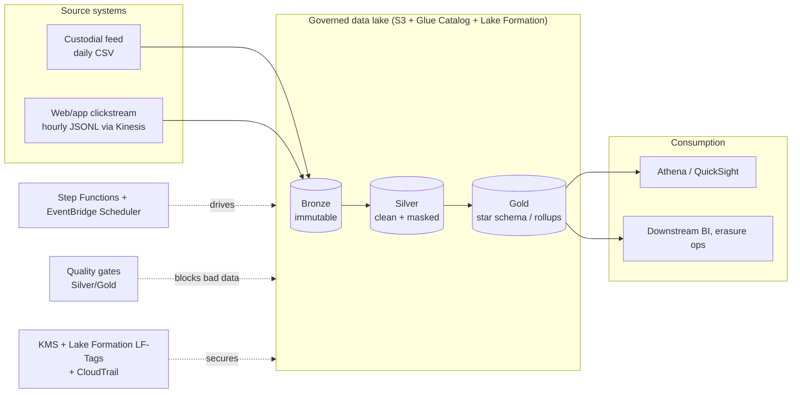
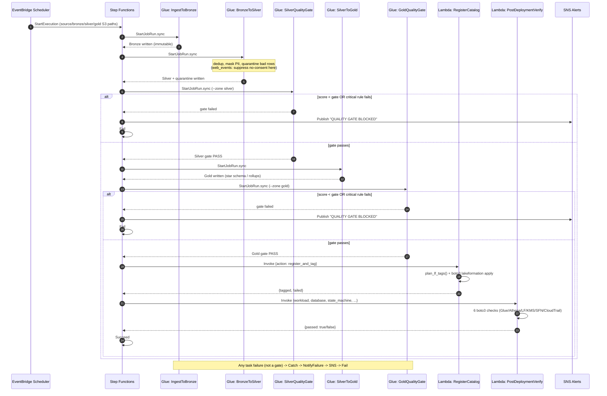

# ADOP Demo — Architecture

This is the build/review reference for the repo: what exists, why it's shaped
this way, how the pieces connect, and where the honest edges are. Read this
before extending the pattern to a new workload or redeploying the sandbox.

- Client-facing story: [`docs/CLIENT_PITCH.md`](CLIENT_PITCH.md)
- Time/cost comparison: [`docs/BEFORE_AFTER.md`](BEFORE_AFTER.md)
- What's demo-grade vs. enterprise-grade: [`docs/ADAPTATION_GAP.md`](ADAPTATION_GAP.md)
- Sandbox provision / destroy: [`docs/SANDBOX_LIFECYCLE.md`](SANDBOX_LIFECYCLE.md)
- Current milestone status: [`docs/STATUS.md`](STATUS.md)
- Agentic layer (Gateway + Harness): [`docs/MODE_B_SETUP.md`](MODE_B_SETUP.md), [`docs/MODE_C1_HARNESS.md`](MODE_C1_HARNESS.md)

---

## 1. System context



Five workloads share one pattern and one codebase layout (Tier A factory proofs + Tier B demo):

| | `advisory_transactions` | `web_events` | `product_inventory` | `supplier_lead_times` | `customer_orders` |
|---|---|---|---|---|---|
| Domain | Wealth/brokerage | Clickstream | Product / SKU | Supplier lead times | E-commerce orders |
| Cadence | Daily 07:00 UTC | Hourly :05 | Daily 08:00 UTC | Weekly | Daily |
| Regulation | SOX | GDPR | None | None | None |
| Gold shape | Star schema | Hourly rollup | Flat Iceberg | Flat Iceberg | Flat Iceberg |
| Orchestrator | Step Functions | SFN (TF disabled) | Step Functions | Step Functions | MWAA (SFN export optional) |
| Role | SOX pilot + extensions | GDPR contrast | Factory #3 | Factory #4 E2E | Tier B #5 |

See the rendered picture: `docs/diagrams/adop-architecture.png`.

---

## 2. Medallion + agent-to-artifact map

ADOP's agents each own one layer of generated artifact. This repo's files are
organized so you can point at a file and say which agent would generate it:

| Agent (AGENTS.md contract) | What it owns | Files in this repo |
|---|---|---|
| Metadata Agent | Source shape, semantics, compliance flags | `workloads/<w>/config/{source,semantic}.yaml` |
| Transformation Agent | Cleaning/masking/dedup/star-schema rules + SQL DDL | `workloads/<w>/config/transformations.yaml`, `workloads/<w>/sql/**/*.sql`, `workloads/<w>/scripts/transform/*.py` |
| Quality Agent | Declarative rules + gate thresholds | `workloads/<w>/config/quality_rules.yaml`, `shared/utils/quality.py`, `workloads/<w>/scripts/quality/run_quality_checks.py` |
| Orchestration Agent | Step Functions ASL + EventBridge schedule | `workloads/<w>/orchestration/*.json` |
| DevOps Agent | Terraform, CI/CD, deploy packaging | `iac/terraform/**`, `.github/workflows/*.yml` |
| (shared) PII/Governance | Masking, LF-Tag classification | `shared/utils/pii.py`, `workloads/<w>/scripts/load/register_catalog.py` |
| (shared) Verification | Post-deploy checks | `shared/utils/post_deployment_verifier.py` |

Both workloads' Bronze is **immutable** (`bronze-immutable` invariant); both
enforce **zone-scoped KMS** (one CMK per Bronze/Silver/Gold); both use the same
quality-gate mechanics (`shared/utils/quality.py`) with per-workload thresholds
and rule sets.

---

## 3. Pipeline flow (sequence diagram)

Both workloads run the identical 8-state shape end to end. This is the
`advisory_transactions_pipeline` / `web_events_pipeline` Step Functions
execution:



**State names** (exact ASL keys, both workloads): `IngestToBronze` →
`BronzeToSilver` → `SilverQualityGate` → `SilverToGold` → `GoldQualityGate` →
`RegisterCatalog` → `PostDeploymentVerify` → `Succeed`, with `NotifyFailure` /
`QualityGateFailed` / `Fail` as the error branches. See
`workloads/<workload>/orchestration/<workload>_state_machine.json`.

---

## 4. Glue jobs and Lambdas (the orchestration targets)

The state machines reference 5 Glue jobs and 2 Lambdas **per workload** — 10
Glue jobs + 4 Lambdas total, all now backed by real Terraform resources
(`iac/terraform/modules/workload_pipeline/{glue,lambda}.tf`):

| # | Glue job name | Job type | Script |
|---|---|---|---|
| 1 | `<workload>_ingest_to_bronze` | glueetl (Spark) | `scripts/extract/ingest_to_bronze.py` |
| 2 | `<workload>_bronze_to_silver` | glueetl (Spark) | `scripts/transform/bronze_to_silver.py` |
| 3 | `<workload>_quality_silver` | pythonshell (0.0625 DPU) | `scripts/quality/run_quality_checks.py --zone silver` |
| 4 | `<workload>_silver_to_gold` | glueetl (Spark) | `scripts/transform/silver_to_gold.py` |
| 5 | `<workload>_quality_gold` | pythonshell (0.0625 DPU) | `scripts/quality/run_quality_checks.py --zone gold` |

`<workload>` is `advisory_transactions` or `web_events`. Quality-gate jobs run
as cheap Python Shell (no Spark cluster) since they only grade a dataframe
against declarative rules — a concrete cost lever worth calling out in the
client room.

| Lambda name | Purpose | Handler |
|---|---|---|
| `<workload>_register_catalog` | Registers Silver/Gold tables, applies Lake Formation LF-Tags to PII columns | `workloads.<workload>.scripts.load.register_catalog.lambda_handler` |
| `<workload>_post_deploy_verifier` | 9 automated post-deploy checks (lake + Redshift + OpenSearch + Redis). Raises if any fail. | `shared.utils.post_deployment_verifier.lambda_handler` |

Both Lambda handlers degrade gracefully: if `boto3` isn't available (or, for
the CLI, if `--dry-run`/no AWS credentials), they print/return a **plan**
instead of calling AWS — the same code path runs locally in tests and for real
in Lambda.

### 4.1 Extension: Redshift / OpenSearch / Redis (advisory_transactions only)

Added after the core pilot to demonstrate extending the framework to AWS
services beyond Glue/Athena/S3 — see `docs/EXTENDING_TO_NEW_SERVICES.md` for
the full recipe and trade-offs. Each is its own Terraform module
(`iac/terraform/modules/{redshift,opensearch,redis}_workload/`). They **are**
wired into `advisory_transactions_pipeline` after `RegisterCatalog` (verified
in execution `phase3-extensions-3`). SFN invoke IAM for these Lambdas lives
on the **root** module to avoid a Terraform cycle.

| # | Lambda / SFN state | Purpose | New AWS resource |
|---|---|---|---|
| 3 | `RegisterRedshiftSpectrum` | `CREATE EXTERNAL SCHEMA` via Data API + admin secret, then `COUNT(*)` | Redshift Serverless |
| 4 | `IndexGoldToOpenSearch` | Athena on Gold → SigV4 `_bulk` | OpenSearch domain `advisory-dev-search` |
| 5 | `CacheQualityScores` | Read `s3://.../quality-scores/...`, SET+GET in Redis | ElastiCache (VPC + S3 gateway endpoint) |

---

## 5. Quality gates and the "no silent drops" invariant

`shared/utils/quality.py` grades a zone's dataframe against a list of
declarative rules from `config/quality_rules.yaml`:

- Each rule has an id, a `pass_rate` computation, and a `critical: true/false` flag.
- **Any critical rule failing blocks promotion outright**, regardless of the
  overall weighted score (e.g. duplicate `transaction_id` in `advisory_transactions`,
  or a consented row missing `event_id` in `web_events`).
- The **gate threshold** is zone-specific and regulation-driven: Silver ≥ 0.80,
  Gold ≥ 0.95 for both workloads (SOX and GDPR both treat Gold as
  client/BI-facing, hence the higher bar).
- Rules that reference columns absent from the zone being graded (e.g. a
  Gold-only completeness rule evaluated against Silver) are **skipped**, not
  failed — see the `try/except KeyError` in `run_quality()`.
- Failing rows are never dropped silently: `bronze_to_silver` routes them to a
  `quarantine` (or `suppressed_no_consent`) frame that gets written to its own
  Parquet/CSV output and, on AWS, its own Iceberg side table
  (`sql/silver/create_silver_table.sql`).

---

## 6. Security & compliance model

| Control | Mechanism | Where |
|---|---|---|
| Encryption at rest | One KMS CMK per zone (Bronze/Silver/Gold), rotation on | `aws_kms_key.zone` in the Terraform module |
| PII masking | Deterministic masking (SSN last-4, email head+domain, IP last-octet zero, SHA-256 hash token) | `shared/utils/pii.py` |
| PII access control | Lake Formation LF-Tags (`PII_Type`, `Data_Sensitivity`) on Silver PII columns, applied per-workload (each workload scopes `PII_CLASSIFICATION` to only the columns it actually has) | `workloads/<w>/scripts/load/register_catalog.py` |
| PII suppression at Gold | Gold drops SSN/email/name (`advisory_transactions`) or email/IP (`web_events`) entirely — no tags needed because the columns don't exist | `config/transformations.yaml` → `gold_pii_policy.suppress` |
| GDPR consent gate | `consent_analytics=false` rows are filtered out in `bronze_to_silver` *before* any other processing and are never written to Silver/Gold | `workloads/web_events/scripts/transform/local_runner.py::bronze_to_silver` |
| Right to erasure | `gold_erasure_index` maps hashed `user_id` → row counts + a documented `DELETE ... WHERE user_id = :token` hook | `local_runner.silver_to_gold` |
| SOX financial integrity | Critical rule: `gross_amount - commission - fees == net_amount` (within tolerance) | `config/quality_rules.yaml` |
| SOX retention | 7-year retention declared in `config/source.yaml`; enforced via S3 lifecycle + Object Lock in a real deploy (not yet wired — see `ADAPTATION_GAP.md` #9) | — |
| Audit trail | CloudTrail check in the post-deploy verifier; full evidence pipeline is an adaptation-gap item | `shared/utils/post_deployment_verifier.py` |
| Least privilege | Per-workload IAM roles for SFN, Scheduler, Glue jobs, and Lambdas, each scoped to that workload's ARNs/prefixes only | `iac/terraform/modules/workload_pipeline/*.tf` |

---

## 7. Infrastructure as Code

```
iac/terraform/
├── main.tf                     # root: 2x module instantiation + shared $25/mo budget
├── variables.tf / outputs.tf   # account_id, region, data_lake_bucket, alert_email, environment
├── terraform.tfvars.example
├── APPLY_GUIDE.md              # step-by-step apply/verify/destroy checklist
└── modules/workload_pipeline/  # reusable — one instantiation per workload
    ├── variables.tf            # workload, glue_jobs map, lambda_functions map, schedule, compliance_tag
    ├── main.tf                 # KMS x3, Glue DB, SNS+sub, SFN role+state machine, Scheduler role+schedule
    ├── glue.tf                 # Glue IAM role + 5x aws_glue_job
    ├── lambda.tf                # Lambda IAM role + 2x aws_lambda_function
    └── outputs.tf
```

**Why a module instead of copy-pasted `.tf` files per workload:** adding a
third workload means one new `module "..." { source = "./modules/workload_pipeline" ... }`
block in root `main.tf` with that workload's job/lambda maps and schedule —
no new HCL resource types to write. This is exactly the kind of reuse the
Terraform-module gap in `ADAPTATION_GAP.md` #1 asks you to go further with
(swap this module's *internals* for the client's own `module "kms"` etc.
without touching root `main.tf` at all).

Both `terraform validate` and `terraform fmt -check` pass against this module
structure (verified locally with Terraform 1.9; CI's `terraform` job in
`.github/workflows/ci.yml` runs the same checks on every PR).

### Packaging {#packaging}

Two very different artifact types flow into AWS, both staged by
`.github/workflows/deploy.yml` before `terraform apply` runs:

1. **Glue job scripts** — `aws s3 sync workloads/<workload>/ s3://<bucket>/workloads/<workload>/`
   for both workloads. `aws_glue_job.command.script_location` points directly
   at the synced `.py` file; no build step needed (Glue reads the script from
   S3 at job-start time).
2. **Lambda deployment packages** — built as **lean, dependency-free zips**:
   for `register_catalog`, just `shared/utils/pii.py` + that workload's
   `register_catalog.py` (both refactored to avoid importing the pandas-based
   `local_runner` module on the Lambda code path — see
   `plan_lf_tags(database=...)`); for `post_deploy_verifier`, just
   `shared/utils/post_deployment_verifier.py`. Both need only the Python
   stdlib + `boto3`, which every Lambda Python runtime ships pre-installed —
   **no `pip install`, no layer, no pandas/pyarrow in the Lambda path at all.**
   Zips are uploaded to `s3://<bucket>/lambda-artifacts/<workload>/<fn>.zip`
   and referenced by `aws_lambda_function.s3_bucket` / `s3_key`.

This lean-package design is why the Lambda handlers are written the way they
are: `register_catalog.plan_lf_tags()` accepts an optional `database` override
so the Lambda path can skip the YAML-driven `local_runner.load_config()` (and
therefore skip importing pandas) entirely.

---

## 8. CI/CD

| Workflow | Trigger | What it does |
|---|---|---|
| `.github/workflows/ci.yml` | every PR / push to `main` | `pytest workloads/` (28 tests, both workloads); validates every `config/*.yaml` parses; validates every `*_state_machine.json` is valid ASL-shaped JSON; `terraform fmt -check` + `terraform validate` (no backend, no AWS creds needed) |
| `.github/workflows/deploy.yml` | manual `workflow_dispatch` (qa/staging/prod) | OIDC auth → sync scripts + build/upload Lambda zips → `terraform apply` (GitHub Environment = human approval gate) → live post-deploy verifier for both workloads |

Nothing deploys on merge. `deploy.yml` requires an explicit human trigger and
a GitHub Environment approval, matching the AGENTS.md "agents generate,
humans promote" boundary.

---

## 9. Local-only execution (no AWS required)

Every script has a `--local` (or default-local) code path that runs against
pure pandas, so the entire demo — generation, transform, quality gates,
catalog/LF-Tag *planning*, verifier *dry-run* — works with zero AWS access:

```bash
pip install -r requirements.txt
python demo/data_generators/generate_advisory_transactions.py
python workloads/advisory_transactions/scripts/run_local_pipeline.py
python demo/data_generators/generate_web_events.py
python workloads/web_events/scripts/run_local_pipeline.py
pytest workloads/ -v
```

The **same rule files** (`config/*.yaml`) drive both the local pandas path and
the (stubbed) Glue/Spark path — see `run_glue()` in each transform script —
so local demo behavior cannot drift from what would run on AWS. Production transform steps declared as `glueetl` in `config/compute.yaml` use PySpark +
Iceberg via `spark_transforms.py` (see `framework-e2e-v6` and `tier-b-e2e-fix-v3` in
`docs/STATUS.md`). Quality gates stay Python Shell. Local tests use `local_runner.py` or
Spark-local fixtures where wired.

---

## 10. Repository map

```
ADOP/
├── demo/data_generators/           # synthetic CSV/JSONL generators (seeded bad rows for quality demo)
├── shared/utils/                   # pii.py, quality.py, post_deployment_verifier.py (dependency-light, reused by both workloads)
├── workloads/
│   ├── advisory_transactions/      # SOX / wealth-management workload
│   └── web_events/                 # GDPR / clickstream workload
│       ├── config/                 # source, semantic, transformations, quality_rules, schedule (YAML)
│       ├── scripts/
│       │   ├── extract/            # ingest_to_bronze.py
│       │   ├── transform/          # local_runner.py (source of truth) + bronze_to_silver.py / silver_to_gold.py (Glue wrappers)
│       │   ├── quality/            # run_quality_checks.py
│       │   ├── load/               # register_catalog.py (LF-Tag plan + apply, Lambda handler)
│       │   └── run_local_pipeline.py  # end-to-end local demo driver
│       ├── sql/{bronze,silver,gold}/*.sql
│       ├── orchestration/          # <workload>_state_machine.json, eventbridge_schedule.json
│       ├── tests/{unit,integration}/
│       ├── memory/MEMORY.md        # workload memory ledger (ADOP `memory-ledger` invariant)
│       └── README.md
├── iac/terraform/                  # see section 7
├── .github/workflows/{ci,deploy}.yml
└── docs/                           # STATUS, SANDBOX_LIFECYCLE, MCP_WIRING, presentations, …
```

---

## 11. Extending the pattern (adding a third workload)

1. Copy the `web_events` directory tree as a starting skeleton (it's the more
   recently added, so closest to current conventions).
2. Write `config/{source,semantic,transformations,quality_rules,schedule}.yaml`
   for the new source.
3. Point `scripts/transform/local_runner.py` at the new config; write/adjust
   `bronze_to_silver` / `silver_to_gold` logic.
4. Add unit + integration tests; add the workload to `ci.yml`'s sample-data
   generation step (or add a data generator if the source needs one).
5. Copy `orchestration/<workload>_state_machine.json` from an existing
   workload and rename the `JobName`/`FunctionName`/`TopicArn` strings to the
   new workload prefix — the 8-state shape (Section 3) is designed to be
   copied as-is.
6. Add a third `module "new_workload" { source = "./modules/workload_pipeline" ... }`
   block to `iac/terraform/main.tf` with the new workload's `glue_jobs` and
   `lambda_functions` maps and schedule expression.
7. Add the new workload to `deploy.yml`'s `for w in ...` loops.

No shared file needs to change except `main.tf` and the two CI/CD loops — that
list is the actual definition of "the pattern is reusable."
