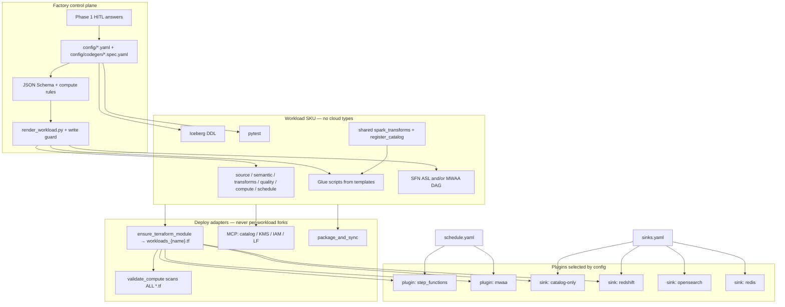

# Architecture Robustness & Pluggability Review

Review-only assessment of this repo’s factory pattern: design flaws, coupling,
demo vs production gaps, and a prioritized backlog. No code changes proposed
here — this is the consulting/backlog artifact.

**Date:** 2026-09-10  
**Implemented:** 2026-09-14 on `feat/factory-sku-pluggability` (P0 + mechanical P1).  
**Scope:** Workload factory, IaC, shared contracts, deploy path, cross-workload
consistency (`advisory_transactions`, `web_events`, `product_inventory`,
`supplier_lead_times`, `customer_orders`).  
**Read with:** `AGENTS.md`, `docs/ARCHITECTURE.md`, `docs/ADAPTATION_GAP.md`,
`docs/STATUS.md`, `docs/EXTENDING_TO_NEW_SERVICES.md`, `SKILLS.md`,
`TOOL_ROUTING.md`.

---

## Executive summary

1. **The factory control plane is the strongest part of the repo.** HITL
   discovery, AgentOutput, Jinja render + write guard + CI drift, `compute.yaml`,
   and `deploy_workload.py --approve-apply` are a coherent SKU pipeline.
   `supplier_lead_times` is the closest thing to “same work order in, same SKU out.”

2. **Codegen stops one layer too early.** Rendered files are Glue wrappers and
   ASL. The actual Iceberg business logic (`spark_transforms.py`,
   `local_runner.py`) and Lake Formation apply (`register_catalog.py`) are
   hand-copied and explicitly *not* guarded. That is what blocks zero-edit
   workload #5.

3. **Two Terraform stories are live at once.** `advisory_transactions` is a hand
   module in `iac/terraform/main.tf`; `supplier_lead_times` is auto-generated
   `workloads_{name}.tf`. `validate_compute.py` only parses `main.tf`, so the
   factory’s own path is invisible to the drift gate.

4. **Orchestrator and sinks are flags, not plugins.** SFN JSON can toggle
   Redshift/OpenSearch/Redis. The matching Terraform, IAM cycle workaround,
   Lambda packaging, and `deploy.yml` loops are still advisory-specific. MWAA is
   DAG codegen only — there is no MWAA module.

5. **Docs overclaim completeness.** `docs/STATUS.md` scores ~94% factory;
   `docs/ARCHITECTURE.md` still describes a two-workload copy-paste recipe.
   Treat STATUS as milestone accounting and ARCHITECTURE §11 as stale.
   `docs/ADAPTATION_GAP.md` is the honest *enterprise* list; the P0s below are
   *factory-correctness* issues that already bite this sandbox.

**Headline:** The factory can emit a catalog-only CSV SKU, but it cannot deploy
that SKU with zero hand edits. Codegen stops at Glue wrappers and ASL. Business
transforms, catalog Lambda, Terraform discovery, and CI deploy loops are still
per-workload craft.

---

## Strengths (what is already pluggable)

| Area | Why it works | Key paths |
|------|--------------|-----------|
| **Declarative compute routing** | Mixed `glueetl` + `pythonshell`; Iceberg → `glueetl` hard rules | `workloads/*/config/compute.yaml`, `contracts/v1/compute.schema.json`, `tools/validate_compute.py`, `modules/workload_pipeline/glue.tf` |
| **Deterministic codegen** | Specs → Jinja → guarded writes + CI drift | `config/codegen/*.spec.yaml`, `shared/templates/*.j2`, `tools/render_workload.py`, `shared/codegen/write_guard.py`, `tools/check_codegen_drift.py` |
| **Reusable pipeline module** | One instantiation per workload; MCP/TF owner toggles | `iac/terraform/modules/workload_pipeline/` |
| **IaC generator (newer path)** | Maps `pipeline_steps` → `glue_jobs` HCL | `tools/ensure_terraform_module.py`, `shared/deploy/workload_tf.py` |
| **Orchestration choice (artifacts)** | SFN and/or MWAA DAG from `schedule.yaml` | `shared/utils/orchestrator.py`, `state_machine.json.j2` extension flags |
| **Shared quality / PII / verifier** | Reused across workloads; local pandas path | `shared/utils/quality.py`, `pii.py`, `post_deployment_verifier.py` |
| **Deploy wrapper gates** | Refuses apply on pending sync / missing module | `tools/deploy_workload.py` |

---

## Workload consistency

| Workload | TF module | Codegen | Spark helper | Orchestrator | Grade |
|----------|-----------|---------|--------------|--------------|-------|
| `advisory_transactions` | `main.tf` (hand) | Full + advisory b2s | `silver_to_gold_tables` | SFN (field often omitted) | Demo + extensions |
| `web_events` | Commented out (PILOT-DISABLED) | JSONL + web_events b2s | Missing | SFN | Local pytest only |
| `product_inventory` | None (`pending`) | Advisory b2s template | `silver_to_gold_dfs` | SFN | Artifacts + pytest |
| `supplier_lead_times` | `workloads_*.tf` (generated) | Advisory b2s template | `silver_to_gold_dfs` | SFN explicit | Best factory SKU |
| `customer_orders` | None (`sync=enforced`!) | DAG only; no SFN spec | `silver_to_gold_dfs` | MWAA | Tier B files, no compute TF |

---

## Design flaws (with file paths)

### 1. Compute ↔ Terraform drift detector points at the wrong file

`tools/validate_compute.py` sets `TERRAFORM_MAIN = .../main.tf` and
`parse_terraform_glue_jobs()` only walks that file. Factory modules live in
`iac/terraform/workloads_supplier_lead_times.tf`. CI will not catch `glue_jobs`
drift on the generated path. `AGENTS.md` still says “`main.tf` glue_jobs MUST
match.”

### 2. Two conflicting “add a workload” recipes

| Source | Recipe |
|--------|--------|
| `prompts/devops/01-iac-agent.md` | Insert a `module` block into `main.tf` |
| `shared/deploy/workload_tf.py` | Write `workloads_{name}.tf` |
| `docs/ARCHITECTURE.md` §11 | Copy `web_events`, copy ASL, edit `main.tf` and `deploy.yml` |

Agents will pick different ones.

### 3. `terraform_sync.status: enforced` does not mean a module exists

`workloads/customer_orders/config/compute.yaml` is `enforced` with no
`module "customer_orders"`. `compare_terraform()` emits a *warning* when
`tf_jobs is None`. Enforced only promotes `DRIFT` lines to errors.

### 4. Business logic is outside the factory

Write guard: renderer owns ingest / b2s / s2g / quality / SFN / DAG — *not*
`local_runner`, `spark_transforms`, `register_catalog`. STATUS A11 table
confirms this. Gold Spark API is unstable: `silver_to_gold_tables` (advisory /
web_events) vs `silver_to_gold_dfs` (factory workloads), wired via
`gold_spark_fn` in `silver_to_gold.spec.yaml`.

### 5. Bronze transform is a named fork, not a slot

`tools/render_workload.py` defaults
`ARTIFACTS["bronze_to_silver"]["template_id"] = "advisory_bronze_to_silver"`.
`web_events` overrides with `web_events_bronze_to_silver`. Schema
`contracts/v1/codegen_bronze_to_silver.spec.schema.json` hard-codes that split
in `oneOf`. JSONL + consent is a second product, not a config field.

### 6. Glue packaging assumes Spark helpers always exist

`glue.tf` `glue_deps_py_files` always includes `spark_transforms.py` and
`local_runner.py`. `tools/package_and_sync.py` `_GLUE_FLAT_PY` uploads them
unconditionally. `web_events` has **no** `spark_transforms.py`. Enabling that
module would fail at sync or job start.

### 7. `compute.yaml` `routing.rules` are documentation

Schema allows unstructured `"routing"`. `validate_compute.py`
`_resolve_effective_job_type()` reimplements the matrix in Python. Two sources
of truth; YAML rules never execute.

### 8. Contracts cover the wrong half of config

`tools/validate_configs.py` only schemas `compute.yaml` and
`transformations.yaml`. No schemas for `source.yaml`, `semantic.yaml`,
`quality_rules.yaml`, `schedule.yaml` — the files that encode HITL answers.

### 9. MCP vs Terraform dual-create is policy, not a lock

`TOOL_ROUTING.md`: never both create the same ARN. `advisory_transactions`
uses MCP owners; `supplier_lead_times` uses Terraform owners.
`register_catalog` still creates/tags tables after MCP catalog. Easy to
double-own Glue DB / KMS / IAM.

### 10. SFN IAM for extensions is root-level and advisory-hardcoded (closed P1-3)

Sinks are selected by `compute.yaml` `sinks:` + SFN spec flags. Pipeline SFN
IAM uses constructed Lambda ARNs. `main.tf` no longer hardcodes advisory
extension modules.

### 11. Orchestrator is not a module feature

`workload_pipeline/main.tf` always creates SFN + EventBridge. No `aws_mwaa_*`
anywhere. `customer_orders` has `orchestrator: mwaa` + DAG and
`terraform_sync: enforced` with nothing to apply for Glue.

### 12. AgentOutput schema disagrees with SKILLS

`SKILLS.md` includes `ontology_staging`.
`shared/templates/agent_output_schema.py` `VALID_AGENT_TYPES` does not. Cedar
includes it. Ontology station can fail the parser.

### 13. CI deploy still thinks there are two workloads

`.github/workflows/deploy.yml`: `for w in advisory_transactions web_events`.
CI tests generate all five datasets; deploy packaging does not.

### 14. Docs drift (causes agent misbehavior)

- `docs/ARCHITECTURE.md` §1 = five workloads; §4/§7/§10 = two; §11 = copy-paste.
- `AGENTS.md` ties Terraform follow to `main.tf`.
- `TOOL_ROUTING.md` legacy exception still says web_events ingest + b2s are
  hand-authored; they now have specs.
- `supplier_lead_times` compute note still says “until DevOps wires main.tf”
  while sync is enforced via the *other* file.

### 15. Least-privilege is demo-shaped (partially closed)

Pipeline Lambdas no longer share one union role (P1-12): `register_catalog` and
`post_deploy_verifier` have separate IAM roles. Glue catalog IAM still uses
`resources = ["*"]`. Redis uses default VPC. Fine for a pitch; not a landing-zone
pattern (`docs/ADAPTATION_GAP.md` #1–#3).

---

## Pluggability gaps

Assume Phase 1 HITL is complete. “Zero hand edits” means: specs + render +
`ensure_terraform_module` + pytest + deploy.yml — no copying Python/HCL.

| Scenario | Status | Why |
|----------|--------|-----|
| New **catalog-only CSV** (clone of `supplier_lead_times`) | **Partial** | Still copy `spark_transforms.py`, `local_runner.py`, `register_catalog.py`, `eventbridge_schedule.json`, SQL, tests. Generator does not emit those. |
| New **JSONL / GDPR** (clone of `web_events`) | **Blocked** | Second bronze template; consent/erasure in `local_runner`; no Spark helper; TF module PILOT-DISABLED. |
| New **star-schema + Redshift** | **Unblocked** | `sinks.redshift: true` + SFN `enable_redshift` + `ensure_terraform_module`. Default false (cost). |
| New **OpenSearch / Redis sink** | **Unblocked** | Same flags. Redis still needs VPC + vendored `redis-py` in the zip. |
| New **orchestrator = MWAA** | **Partial** | DAG + pipeline skip SFN (P1-4). No `aws_mwaa_*` environment (P1-5). |
| **CI/CD promotion** of a new SKU | **Done** | `deploy.yml` discovers TF modules. |
| **Drift-safe TF** for a generated module | **Done** | `validate_compute.py` scans all `*.tf`; sink modules required when flags on. |

`product_inventory` proves the gap: full codegen, `terraform_sync: pending`,
“No Terraform module yet.” Factory #2 was artifacts + pytest, not a deployable
SKU.

---

## Recommended target architecture

One **workload SKU** (config + rendered code + SQL + tests). **Adapters**
(TF gen, MCP, package_and_sync) consume the SKU. **Plugins** (orchestrator,
sinks) are selected by config, not by forking `main.tf`.

**Contract to aim for:**

- `compute.yaml` is the only Glue job map
- `schedule.yaml` is the only orchestrator switch
- A new `sinks.yaml` (or SFN spec flags *plus* matching TF generator) is the
  only sink switch
- Humans never edit `main.tf` or `deploy.yml` for workload #N

---

## Demo-grade vs production-grade

| Layer | Demo-grade (this sandbox) | Production-grade (consulting) |
|-------|---------------------------|-------------------------------|
| Factory correctness | P0/P1 below — already broken for “drop-in SKU” | Same P0/P1; required before claiming plant |
| IaC | Raw `aws_*` in `workload_pipeline` | Client module library (`ADAPTATION_GAP` #1) |
| IAM | Self-authored roles; union Lambda policy | Permissions boundaries; vended roles (#2) |
| Networking | No VPC / default VPC for Redis | Private subnets + endpoints (#3) |
| Classification | Generic LF-Tags | Firm taxonomy (#4) |
| Topology | Single account | Control Tower OUs / RAM (#5) |
| Retention | Declared in config only | S3 lifecycle + Object Lock (#9) |
| AgentOps | Ad hoc Cursor / optional Gateway | Prompt pinning, Cedar in loop, audit (#10) |

**One line:** the sandbox already runs a medallion SFN with Iceberg and a
factory SKU on disk; it is **not** a plant you can stamp into a Control Tower
account, and it is **not** yet “drop in workload #5 with zero hand edits.”
Those are two different backlogs — P0/P1 vs `ADAPTATION_GAP.md`.

---

## Prioritized backlog

Effort: **S** = small (hours), **M** = medium (1–3 days), **L** = large (multi-day / design).

### P0 — factory is lying about itself

Do these before claiming SKU #6.

| ID | Item | Effort | Files |
|----|------|--------|-------|
| P0-1 | Parse **all** `iac/terraform/*.tf` for `glue_jobs`, not just `main.tf` | S | `tools/validate_compute.py` |
| P0-2 | `terraform_sync=enforced` must fail if no `module "{name}"` exists | S | `validate_compute.py`, `tools/deploy_workload.py` |
| P0-3 | Single IaC recipe: generated `workloads_{name}.tf` only; stop telling agents to patch `main.tf` | S | `prompts/devops/01-iac-agent.md`, `docs/ARCHITECTURE.md` §7/§11, `AGENTS.md` |
| P0-4 | Lift `spark_transforms` + `register_catalog` into `shared/` (or codegen them). Per-workload copies become thin shims or disappear | M | `workloads/*/scripts/transform/spark_transforms.py`, `scripts/load/register_catalog.py`, `shared/codegen/write_guard.py` |
| P0-5 | Glue `--extra-py-files` / `package_and_sync` skip missing helpers | S | `modules/workload_pipeline/glue.tf`, `tools/package_and_sync.py` |
| P0-6 | Align `customer_orders` `terraform_sync` with reality (`pending` until a module exists) — or generate one | S | `workloads/customer_orders/config/compute.yaml` |

**Suggested first slice:** P0-1 + P0-2 + P0-3 (make the drift gate and IaC
recipe tell the truth), then P0-4 (shared Spark/catalog).

### P1 — make “workload N” mechanical

| ID | Item | Effort | Files |
|----|------|--------|-------|
| P1-1 | One generic `bronze_to_silver` template; `format: csv\|jsonl` + optional consent slot. Retire advisory-named default | M | `shared/templates/`, `tools/render_workload.py`, `contracts/v1/codegen_bronze_to_silver.spec.schema.json` |
| P1-2 | JSON Schema for `source.yaml`, `semantic.yaml`, `quality_rules.yaml`, `schedule.yaml` | M | `contracts/v1/`, `tools/validate_configs.py` |
| P1-3 | **Done** — sink flags instantiate TF modules + Lambda zips + SFN IAM without editing `main.tf` | L | `compute.yaml` `sinks`, `shared/deploy/workload_tf.py`, `modules/workload_pipeline` `enabled_sinks` |
| P1-4 | Orchestrator-aware `workload_pipeline`: SFN+Scheduler **or** MWAA DAG bucket; do not require ASL for `orchestrator: mwaa` | M | `modules/workload_pipeline/main.tf`, `schedule.yaml` |
| P1-5 | MWAA Terraform module (or honest “DAG export only” status in STATUS/SKILLS) | M | new `modules/mwaa_workload/`, `tools/sync_mwaa_dags.py` |
| P1-6 | `deploy.yml` discovers workloads that have a TF module | S | `.github/workflows/deploy.yml` |
| P1-7 | Add `ontology_staging` to `VALID_AGENT_TYPES` | S | `shared/templates/agent_output_schema.py` |
| P1-8 | Unify Gold Spark function name (`silver_to_gold_dfs` everywhere) | S | `spark_transforms.py`, `*/codegen/silver_to_gold.spec.yaml` |
| P1-9 | Codegen `eventbridge_schedule.json` | S | new template + `render_workload.py` ARTIFACTS |
| P1-10 | **Done** — MCP-first default + CI lock if YAML/HCL would both create catalog/KMS/IAM | M | `compute.yaml` `infrastructure`, `docs/MCP_GUARDRAILS.md`, `tools/validate_compute.py` |
| P1-11 | Rewrite `docs/ARCHITECTURE.md` to five workloads + generated TF; delete copy-paste §11 | S | `docs/ARCHITECTURE.md` |
| P1-12 | **Done** — per-Lambda IAM (catalog write vs verifier read) | M | `modules/workload_pipeline/lambda.tf`, `shared/deploy/mcp_iam.py` |

### P2 — production / enterprise

Already well-stated in `docs/ADAPTATION_GAP.md`. Do not confuse with factory P0.

| ID | Item | Effort | Files |
|----|------|--------|-------|
| P2-1 | Client approved module library, permissions boundaries, VPC endpoints | L | `ADAPTATION_GAP.md` #1–#3, `modules/workload_pipeline/*.tf` |
| P2-2 | S3 lifecycle + Object Lock for declared retention | M | `ADAPTATION_GAP.md` #9, `source.yaml` |
| P2-3 | Map LF-Tags to firm taxonomy | M | `semantic.yaml`, `register_catalog.py` |
| P2-4 | Execute `compute.yaml` `routing.rules` instead of duplicating in Python | M | `validate_compute.py`, `compute.schema.json` |
| P2-5 | MCP `create_job` / `CreateStateMachine` to shrink TF | L | `TOOL_ROUTING.md` Step 6 |
| P2-6 | Multi-cloud capability interfaces (warehouse / search / cache) | L | `EXTENDING_TO_NEW_SERVICES.md`; Phase 7 in STATUS |
| P2-7 | Cedar in the Cursor loop (policies exist; not a PreToolUse gate) | M | `shared/policies/`, `.cursor/hooks.json` |
| P2-8 | Gold schema style as a template family (star / flat / rollup) so `local_runner` is not the real codegen | L | `transformations.yaml` `schema_style`, templates |

---

## Related docs

| Doc | Role |
|-----|------|
| `docs/ARCHITECTURE.md` | What exists today (partially stale on workload count / §11) |
| `docs/ADAPTATION_GAP.md` | Enterprise landing-zone SOW (P2) |
| `docs/STATUS.md` | Milestone % — not a robustness score |
| `docs/EXTENDING_TO_NEW_SERVICES.md` | Sink recipe (manual today) |
| `TOOL_ROUTING.md` | MCP vs TF ownership policy |
| Canvas (optional) | Cursor canvas `ADOP-architecture-review.canvas.tsx` (same review as tables/DAG beside chat) |

---

*Review dated 2026-09-10. P0 + mechanical P1 implemented on
`feat/factory-sku-pluggability` (2026-09-14). P1-10 MCP-first default + dual-owner CI
lock added 2026-09-14. P1-12 per-Lambda IAM split and P1-3 sink plugins added
2026-09-14. Remaining: MWAA environment module (P1-5),
and enterprise P2 in `ADAPTATION_GAP.md`.*
