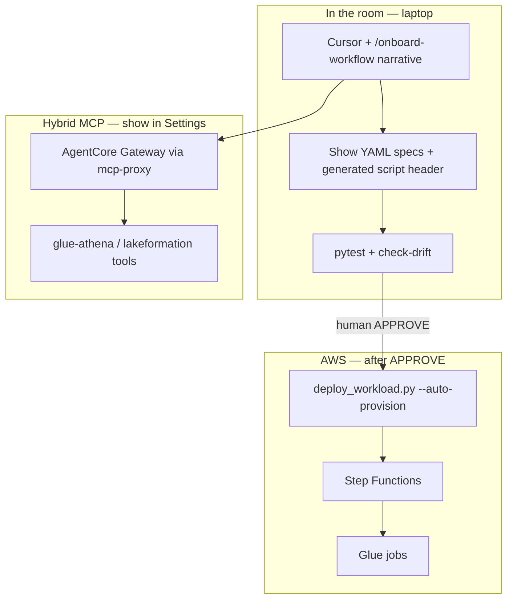
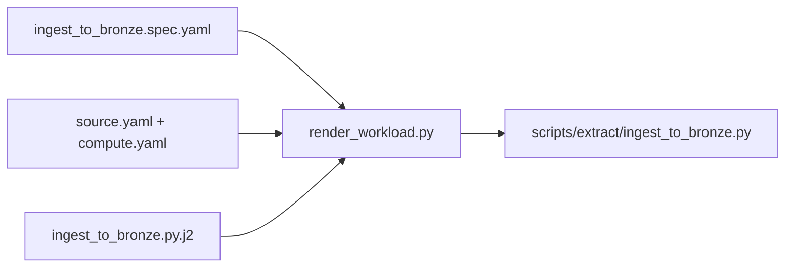
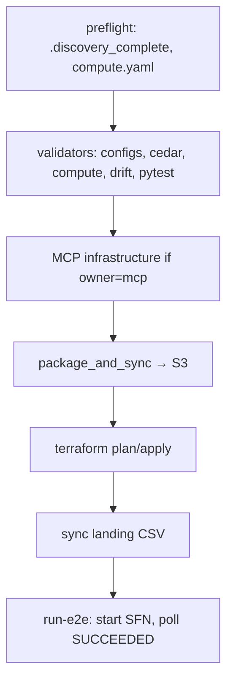

# Demo prep — modes A, B, C, D (laptop + hybrid, mixed audience)

**Demo workload:** `supplier_lead_times` (catalog-only, low cost, factory acceptance proof)  
**Format:** Laptop factory (Acts 1–2) + **hybrid MCP** (show Gateway tools in Cursor)  
**Audience:** Mixed technical + executive — lead with outcomes, drill down on request

**Companion docs:** [`FACTORY_LEARNING_GUIDE.md`](FACTORY_LEARNING_GUIDE.md) · [`CLIENT_DEMO_RUNBOOK.md`](CLIENT_DEMO_RUNBOOK.md) · **Slides:** [`presentations/demo-laptop-hybrid-deck.html`](presentations/demo-laptop-hybrid-deck.html)

---

## Session schedule (cover all four modes before demo day)

| Session | Mode | Duration | AWS cost | Deliverable |
|---------|------|----------|----------|-------------|
| **1** | **A — Concept drill** | 45 min | $0 | Pass self-quiz ≥80% |
| **2** | **B — File trace** | 60 min | $0 | Can narrate spec→script and deploy phases |
| **3** | **C — Demo rehearsal** | 45 min | $0 | 30-min talk track memorized |
| **4** | **D — Live dry run** | 2–3 h | ~$2–5 | One green SFN + teardown |

**Order matters:** A → B → C → D. Do not skip D — mixed audiences ask “did it actually run?”

---

## Demo day architecture (laptop + hybrid)



**Talking point for executives:** “Discovery and rules stay human-governed; code and infra are generated and validated before anything touches AWS.”

**Talking point for engineers:** “Specs render to Glue + SFN; MCP owns catalog/LF; Terraform owns jobs; hybrid Gateway is the tool bus, not the data plane.”

---

## Mode A — Concept drill

Study [`FACTORY_LEARNING_GUIDE.md`](FACTORY_LEARNING_GUIDE.md) Steps 1–6 first, then answer without looking.

### Quiz (20 questions)

| # | Question | Answer |
|---|----------|--------|
| 1 | Name the three layers | Pipeline (data SKU) · Factory (specs→codegen) · Operations (MCP/sandbox) |
| 2 | Tier A vs Tier B in one line each | A = factory on disk · B = AgentOps (Gateway, Cedar, Harness) |
| 3 | Does Bronze→Silver run on your laptop in production? | No — Glue on AWS after deploy |
| 4 | SFN order (include gates) | Ingest → B2S → Silver gate → S2G → Gold gate → Catalog → Verify |
| 5 | Silver gate threshold | ≥ 0.80, no critical rule fail |
| 6 | Why B2S is Spark | Iceberg Silver write requires glueetl |
| 7 | Why quality is Shell | Scores sidecar/sample; no Iceberg rewrite |
| 8 | Edit ingest script directly? | No — edit spec, re-render |
| 9 | Sub-agents call MCP? | No — main agent, Phase 5 only |
| 10 | MCP creates Glue jobs? | No — Terraform creates jobs |
| 11 | MCP creates what two things? | Glue DB/tables, Lake Formation (also IAM/KMS when mcp-owned) |
| 12 | Default demo workload | `supplier_lead_times` |
| 13 | web_events Terraform? | Commented out — local/GDPR contrast |
| 14 | Path for new workload | Path 1 — onboard-workflow on laptop |
| 15 | hybrid vs pipeline | hybrid = MCP connection mode, not where Glue runs |
| 16 | `--auto-provision` expands to | ensure-tf-module + approve-apply + sync-landing + run-e2e |
| 17 | After demo teardown commands | `destroy_sandbox.py --yes` + `switch_mcp_mode --mode local` |
| 18 | Quality gate vs PostDeploymentVerify | Gate = row rules during pipeline; Verify = post-deploy env checks |
| 19 | Generated file proof | Header lines spec_hash, template_id, rendered_at |
| 20 | Human gate before build | Phase 1 discovery — `.discovery_complete` |

**Pass:** 16+/20. Re-read the step for any missed topic.

### Flash cards (executive-friendly)

- **What is it?** Agent-assisted factory for governed lakehouse pipelines on AWS.  
- **What’s different?** Specs are truth; agents don’t hand-write production scripts.  
- **What’s safe?** Human discovery + approve before deploy; quality gates block bad data.  
- **What’s the cost story?** Serverless per run; sandbox destroy when done.

---

## Mode B — File trace

Walk these paths in order. Open files side-by-side in the IDE.

### Trace 1 — Spec → generated ingest script



| Step | File | What to say |
|------|------|-------------|
| 1 | `workloads/supplier_lead_times/config/codegen/ingest_to_bronze.spec.yaml` | Machine contract: workload name, bronze table, sample CSV path |
| 2 | `workloads/supplier_lead_times/config/source.yaml` | Human rules: cadence, PK, zones |
| 3 | `shared/templates/ingest_to_bronze.py.j2` | Shared pattern — `{{ workload }}`, `{{ bronze_table }}` slots |
| 4 | `tools/render_workload.py` | Merges spec + template; sets `ADOP_RENDERER_TOKEN` |
| 5 | `scripts/extract/ingest_to_bronze.py` | Generated — note `spec_hash` header; do not edit |

**Command:**

```powershell
python tools/render_workload.py --workload supplier_lead_times --all --check-drift
```

### Trace 2 — Human rules vs machine spec

| File | Layer | Example content |
|------|-------|-----------------|
| `config/transformations.yaml` | Human | Dedup keys, quarantine rules, Gold grain |
| `config/codegen/bronze_to_silver.spec.yaml` | Machine | DB name, silver table, template binding |
| `config/quality_rules.yaml` | Human | Thresholds, critical rules |
| `config/compute.yaml` | Both | Spark vs Shell per step; MCP vs TF owners |

### Trace 3 — `deploy_workload.py` phases



| Phase | Code location | Client-visible |
|-------|---------------|----------------|
| Preflight | `preflight()` | “We refuse deploy if discovery incomplete” |
| Validators | lines ~226–240 | “Same checks as CI” |
| MCP infra | `mcp_deploy_infrastructure.py` | “Catalog and LF before jobs” — **show hybrid MCP here** |
| Sync | `package_and_sync.py` | Glue scripts + Lambda zips to S3 |
| Terraform | `iac/terraform/workloads_*.tf` | Jobs, SFN, EventBridge, SNS |
| E2E | `shared/deploy/sfn_e2e.py` | Step Functions console — green run |

**Dry-run (safe in demo intro):**

```powershell
python tools/deploy_workload.py --workload supplier_lead_times --dry-run
```

### Trace 4 — Hybrid MCP files

| File | Role |
|------|------|
| `tool-registry/servers.yaml` | 13 servers |
| `.cursor/mcp.json` | Generated Cursor config |
| `tools/switch_mcp_mode.py --mode hybrid` | Gateway for glue-athena + lakeformation |
| `docs/MCP_WIRING.md` | Cursor reload + mcp-proxy note |

**Pre-demo hybrid setup:**

```powershell
python tools/deploy_mcp_gateway.py --profile aws-agent
python tools/switch_mcp_mode.py --mode hybrid --aws-profile aws-agent
python tools/verify_gateway_mcp.py --profile aws-agent
# Reload Cursor → Settings → MCP
```

---

## Mode C — Demo rehearsal (mixed audience, ~30 min)

### Minute-by-minute talk track

| Min | Act | Executive hears | Engineer sees |
|-----|-----|-----------------|---------------|
| 0–3 | Hook | “Weeks → days for governed lakehouse onboarding; human stays in control.” | README architecture diagram |
| 3–8 | Problem | Manual DE = drift, weak governance, slow onboarding | `BEFORE_AFTER.md` one stat |
| 8–15 | Act 1 Factory | Discovery questions → YAML specs | `/onboard-workflow` groups; show `config/` |
| 15–18 | Codegen | “No hand-written Glue for standard steps” | `spec_hash` header + `check-drift` |
| 18–20 | Hybrid | “Deploy tools can run via secure Gateway” | Cursor MCP panel, 2 tools green |
| 20–25 | Act 2 Deploy | “Explicit APPROVE → one command → pipeline live” | `deploy_workload.py --auto-provision` |
| 25–28 | Act 3 Verify | “Quality gates blocked bad data; verify passed” | SFN graph all green |
| 28–30 | Close | Sandbox destroyed — no idle cluster cost | `destroy_sandbox.py` mention |

### Likely questions — short answers

**Executive**

| Q | A |
|---|---|
| Is the agent autonomous? | No — discovery and deploy require human answers and approval. |
| SOX/GDPR ready? | Patterns built in (masking, gates, audit); production needs your policies layered on. |
| Lock-in? | Specs in git, open templates, Terraform for infra — portable. |
| Cost? | Serverless per run; we tear down sandbox after demo (~$2–5 per full run). |
| vs Databricks/Snowflake? | Complementary — this is AWS-native lakehouse factory, not a warehouse replacement. |

**Technical**

| Q | A |
|---|---|
| Why Iceberg? | ACID, time travel, Glue catalog integration. |
| Why mix Shell + Spark? | Spark for Iceberg transforms; Shell for lightweight quality scoring. |
| MCP vs Terraform? | MCP: catalog/LF/IAM/KMS. Terraform: Glue jobs, Lambda, SFN. |
| Why hybrid Gateway? | Cursor SigV4 quirk; mcp-proxy bridges to AgentCore securely. |
| Codegen drift? | CI fails if specs and generated scripts diverge. |
| New workload steps? | `/onboard-workflow` → render → pytest → deploy after approve. |

### What to skip live (have FAQ ready)

- OpenSearch / Redshift / Redis (hourly cost)  
- Live MWAA (~$350/mo)  
- Option B Harness (mention as roadmap unless pre-staged)  
- `web_events` unless GDPR question — then local test only  

---

## Mode D — Live dry run checklist

Run **3–5 days before** the client demo. Use the same profile and bucket naming you will use live.

### Before (15 min)

```powershell
aws login --profile aws-agent
aws sts get-caller-identity --profile aws-agent

copy iac\terraform\terraform.tfvars.example iac\terraform\terraform.tfvars
# Edit account_id, data_lake_bucket, alert_email

cd iac\terraform && terraform init && cd ..\..

python tools/mcp_health_check.py
python tools/deploy_mcp_gateway.py --profile aws-agent
python tools/switch_mcp_mode.py --mode hybrid --aws-profile aws-agent
```

### Dry-run only (no spend)

```powershell
python tools/deploy_workload.py --workload supplier_lead_times --dry-run
python -m pytest workloads/supplier_lead_times/tests/ -v
python tools/render_workload.py --workload supplier_lead_times --all --check-drift
```

### Full provision (~90 min wall clock)

```powershell
python tools/deploy_workload.py `
  --workload supplier_lead_times `
  --bucket adop-datalake-<ACCOUNT>-us-east-1 `
  --auto-provision `
  --aws-profile aws-agent
```

**Capture for demo:**

- SFN execution name/ARN  
- Screenshot: all states green  
- One Athena row count or verifier log line  

### Teardown (required)

```powershell
python tools/destroy_sandbox.py --dry-run
python tools/destroy_sandbox.py --yes
python tools/switch_mcp_mode.py --mode local
```

### Dry-run failure triage

| Symptom | Check |
|---------|-------|
| `terraform_sync pending` | `python tools/ensure_terraform_module.py --workload supplier_lead_times` |
| MCP health fail | `generate_mcp_config.py`; reload Cursor |
| Gateway Error in Cursor | `verify_gateway_mcp.py`; use hybrid not raw URL |
| SFN fails at B2S | CloudWatch Glue log; Iceberg catalog — see `PILOT_FAILURES_AND_FIXES.md` |
| LF denied | MCP LF grants or `register_catalog` path |

---

## Demo day run-of-show (laptop + hybrid)

```text
T-30  mcp_health_check + hybrid mode + Cursor reload
T-15  terraform init if needed; bucket head-bucket
T-0   Act 1: onboard narrative + show supplier_lead_times specs (pre-built OK)
T+10  Show render --check-drift + pytest (fast)
T+12  Show Cursor MCP hybrid connected (2 Gateway tools)
T+15  "Approve deploy" → deploy_workload --auto-provision
T+35  SFN green → Act 3 verify narrative
T+40  Q&A — use Mode C answer table
T+45  Schedule destroy_sandbox after room clears
```

---

## Self-score after all four modes

| Mode | Done? | Confidence 1–5 |
|------|-------|----------------|
| A Concept | | |
| B File trace | | |
| C Rehearsal | | |
| D Live dry run | | |

**Demo-ready:** all four checked, D had one green SFN, average confidence ≥4.
