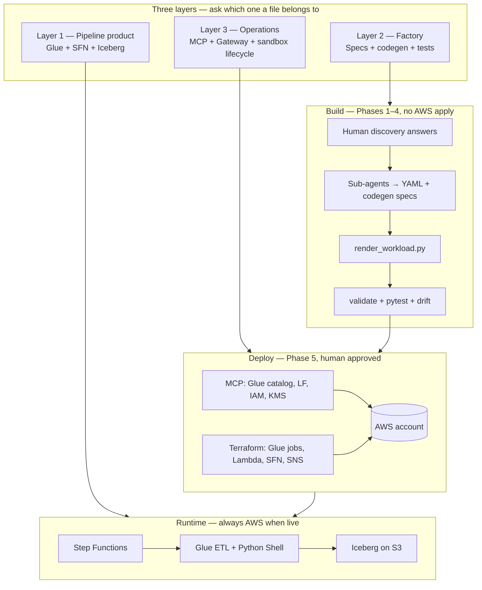
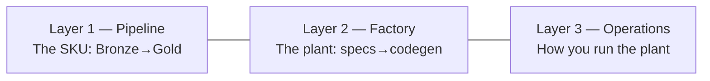
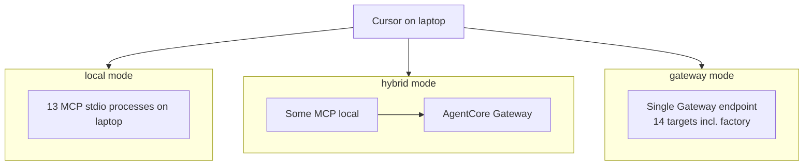
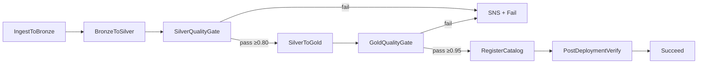
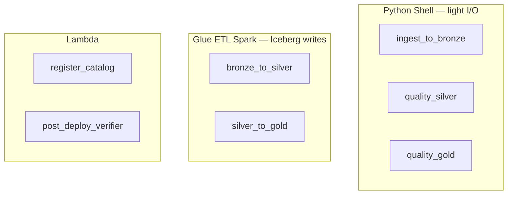
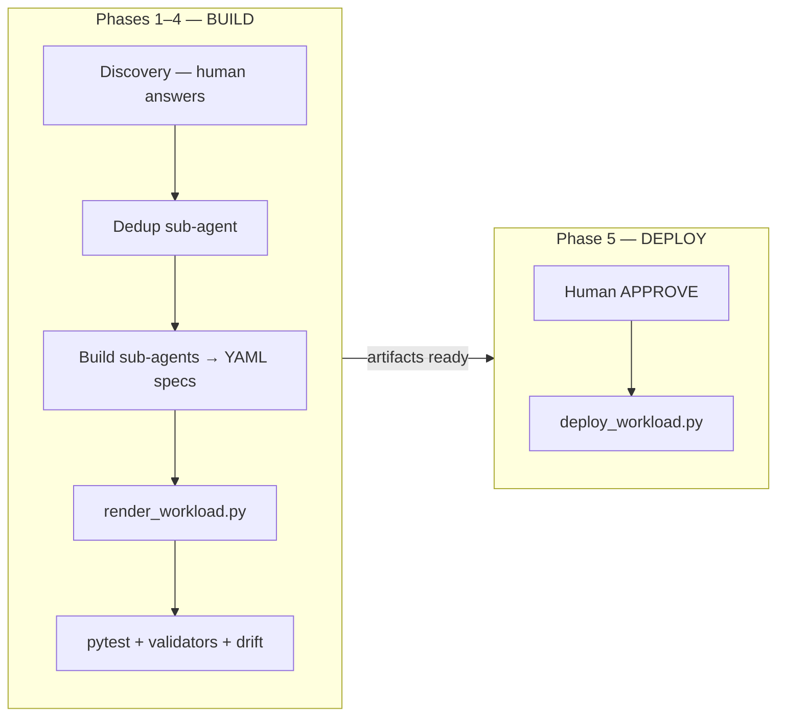
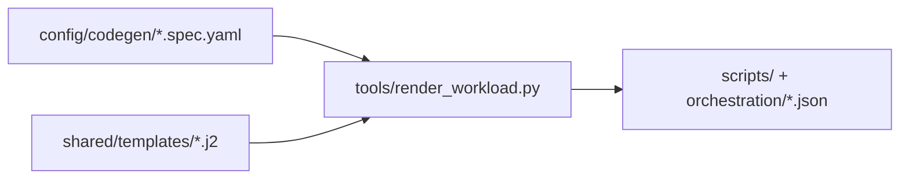
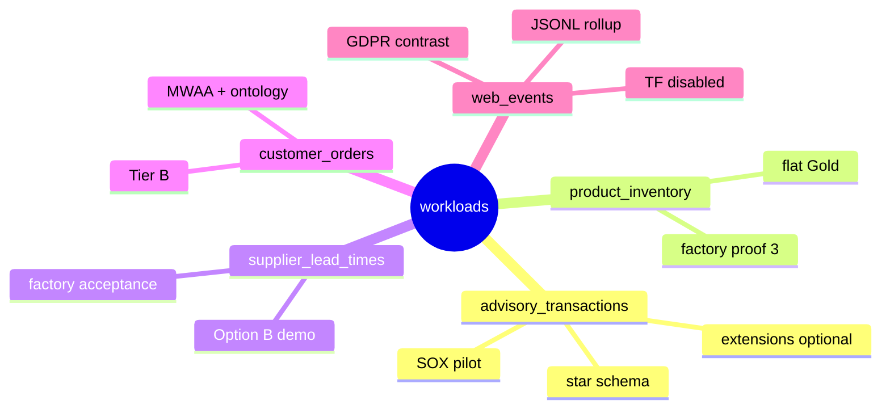
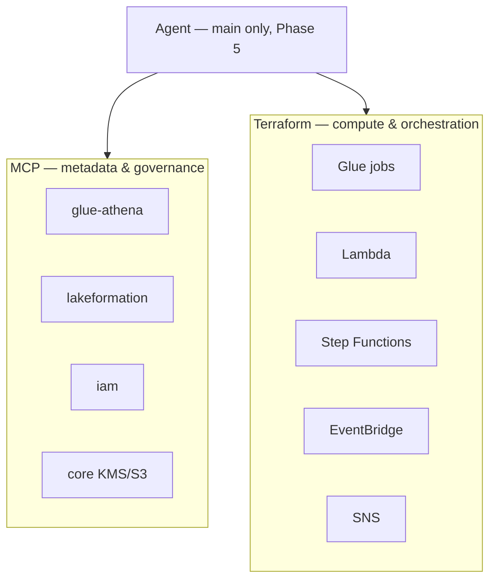
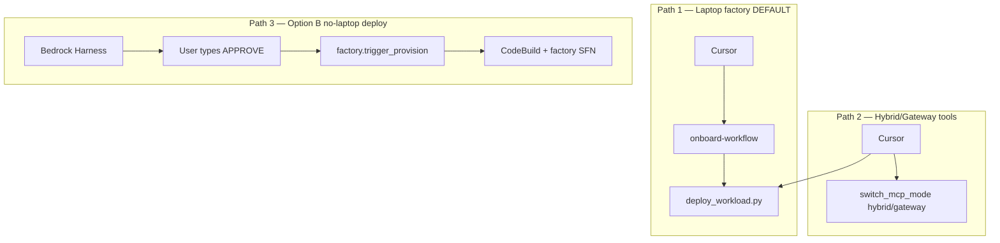

# Factory learning guide — concepts, diagrams, demo prep

**Purpose:** One place to internalize what this repo is, how the pieces connect, and how to
prepare for a client demo. Complements (does not replace) `README.md`, `AGENTS.md`, and
[`CLIENT_DEMO_RUNBOOK.md`](CLIENT_DEMO_RUNBOOK.md).

**Audience:** You, before a live demo. Read one section per sitting; use the checklists at
the end of each step.

**Last aligned with repo:** 2026-09-25 (Tier A complete, Tier B on disk, sandbox typically destroyed).

---

## How to use this guide

| If you want… | Read |
|--------------|------|
| Big picture in 10 min | [Step 1](#step-1--why-this-repo-exists-three-layers) + diagrams below |
| Understand one pipeline | [Step 2](#step-2--what-a-pipeline-workload-is) + `workloads/advisory_transactions/README.md` |
| Understand codegen | [Step 3](#step-3--how-the-factory-builds-a-workload) |
| Pick a demo workload | [Step 4](#step-4--five-workloads-five-proofs) + [Demo prep week](#demo-prep-week-schedule) |
| MCP / Gateway confusion | [Step 5](#step-5--mcp--gateway-deploy-tools-not-pipeline-jobs) |
| Provision / destroy / Option B | [Step 6](#step-6--three-ways-to-run-the-factory) |
| Done vs pending | [Step 7](#step-7--current-state--reading-order) |

---

## Master diagram — everything in one view



---

## Step 1 — Why this repo exists (three layers)

### The transformation story

| Before | After |
|--------|-------|
| One hand-built sandbox pipeline | Repeatable **factory**: same discovery → specs → generated scripts → deploy |
| Agent writes Python ad hoc | Agent writes **YAML**; renderer owns **scripts + SFN JSON** |
| Deploy = mystery | Deploy = MCP (metadata) + Terraform (compute), gated by human **APPROVE** |

### Three layers (memorize this)



| Layer | Question it answers | Example files |
|-------|-------------------|---------------|
| **Pipeline** | What runs the data? | `scripts/transform/bronze_to_silver.py`, `orchestration/*_state_machine.json` |
| **Factory** | How is that code produced? | `config/codegen/*.spec.yaml`, `shared/templates/*.j2`, `tools/render_workload.py` |
| **Operations** | How does the agent talk to AWS / demo lifecycle? | `.cursor/mcp.json`, `tools/provision_sandbox.py`, `docs/MCP_WIRING.md` |

### Tier A vs Tier B

| | Tier A | Tier B |
|---|--------|--------|
| **Means** | Factory process on disk | AgentOps around the factory |
| **Includes** | Onboard command, codegen, write guard, 4 proof workloads | Gateway, Cedar, ontology, MWAA codegen, Harness, Option B factory |
| **Does NOT mean** | “Pipeline runs on laptop” | “Pipeline runs from AWS instead of laptop” |

**Critical correction:** Glue and Step Functions **always run in AWS** once deployed. Laptop vs Gateway vs Harness changes **who operates the factory**, not where Bronze→Silver executes.

### MCP connection modes (Layer 3 only)



| Mode | Use when |
|------|----------|
| `local` | Daily build, health check without Gateway |
| `hybrid` | Demo: cloud tools for glue-athena / lakeformation |
| `gateway` | Full cloud MCP bus |

Commands: `python tools/switch_mcp_mode.py --mode local|hybrid|gateway`

### Step 1 checklist

- [ ] I can explain pipeline vs factory vs operations in one sentence each
- [ ] I know Tier B is AgentOps scaffolding, not “AWS-only pipelines”
- [ ] I know local/hybrid/gateway = MCP connection, not pipeline runtime

---

## Step 2 — What a pipeline (workload) is

### Medallion flow (AWS)



**Quality gates are not checksums.** They enforce score thresholds and **critical rules**
(e.g. SOX financial integrity). Fail → stop pipeline, alert.

**PostDeploymentVerify** checks the deployed environment (tables, permissions, etc.) after
catalog registration.

### Zones (business meaning)

| Zone | Mutability | Typical work |
|------|------------|--------------|
| **Bronze** | Immutable | Raw landing, no business fixes |
| **Silver** | Updatable | Dedup, types, PII mask, quarantine |
| **Gold** | Updatable | Business shape (star, flat, rollup) |
| **Catalog** | Register | Glue + Lake Formation tags |

### Compute per step (`config/compute.yaml`)



**Hard rule:** Silver/Gold on **Iceberg** ⇒ transforms **must** be `glueetl` (Spark), not
because the file is “big,” but because the platform requires Spark for Iceberg commits.

Quality gates use Shell because they **score** sidecars/samples — they do not rewrite Iceberg.

### One workload folder map

```
workloads/{name}/
├── config/           ← human rules (source, transforms, quality, compute, schedule)
├── config/codegen/   ← machine specs for renderer
├── scripts/          ← Glue/Lambda entrypoints (many generated)
├── sql/              ← DDL per zone
├── orchestration/    ← Step Functions + EventBridge
└── tests/            ← pytest
```

### Step 2 checklist

- [ ] I can recite the SFN step order including both quality gates
- [ ] I know why B2S and S2G are Spark while quality is Shell
- [ ] I know config = rules, scripts = workers, orchestration = conductor

**Deep dive workload:** `workloads/advisory_transactions/`

---

## Step 3 — How the factory builds a workload

### Build vs deploy (never mix)



**Sub-agents:** no AWS, no MCP, no Terraform. **Main agent** deploys only after explicit approval.

### Spec vs transformation vs generated script

| Artifact | Who owns it | Contains |
|----------|-------------|----------|
| `config/transformations.yaml` | Human rules | Dedup, masking, quarantine, Gold shape — *what* to do |
| `config/codegen/bronze_to_silver.spec.yaml` | Renderer input | Table names, DB, template slots — *bind rules to this workload* |
| `scripts/transform/bronze_to_silver.py` | **Generated** | Glue entrypoint — **do not hand-edit** |

Change flow:

```
Edit spec or shared template → render_workload.py --write → check-drift → pytest
```

Generated files have a header:

```text
# spec_hash: ...
# template_id: ingest_to_bronze
# rendered_at: ...
```

### Codegen pipeline



| Template | Generated |
|----------|-----------|
| `ingest_to_bronze.py.j2` | `scripts/extract/ingest_to_bronze.py` |
| `bronze_to_silver.py.j2` or `web_events_bronze_to_silver.py.j2` | `scripts/transform/bronze_to_silver.py` |
| `silver_to_gold.py.j2` | `scripts/transform/silver_to_gold.py` |
| `quality_checks.py.j2` | `scripts/quality/run_quality_checks.py` |
| `state_machine.json.j2` | `orchestration/{name}_state_machine.json` |

**Hand-authored exceptions:** `spark_transforms.py`, `register_catalog.py`, `local_runner.py`

**Write guard:** `.cursor/hooks.json` → `shared/codegen/write_guard.py` blocks agent edits to generated paths.

### Factory entry point

`.cursor/commands/onboard-workflow.md` — Phase 1 six question groups before any file writes.

### Step 3 checklist

- [ ] I know sub-agents write specs, not Glue scripts
- [ ] I know to edit spec + re-render, not generated `.py`
- [ ] I can name the three validators: `validate_configs`, `validate_compute`, `check_codegen_drift`

---

## Step 4 — Five workloads, five proofs



| Workload | Proves | Demo role |
|----------|--------|-----------|
| `advisory_transactions` | Richest SOX story | Deep technical Q&A; extensions costly |
| `product_inventory` | Second simple onboard | Factory variety |
| **`supplier_lead_times`** | **Tier A acceptance** | **Default live demo workload** |
| `customer_orders` | Tier B (MWAA, ontology) | Advanced / optional |
| `web_events` | GDPR + JSONL + rollup | Local contrast; TF off |

### web_events (often skipped — worth knowing)

| vs advisory | web_events |
|-------------|------------|
| SOX / daily CSV | GDPR / hourly JSONL |
| Star schema Gold | Hourly **rollup** Gold |
| Quarantine bad math | **Drop no-consent** rows |
| — | **Erasure index** hook |

Terraform module **commented out** in `iac/terraform/main.tf` — intentional cost/focus choice.
Local demo + pytest still work.

### Step 4 checklist

- [ ] Default demo workload = `supplier_lead_times`
- [ ] SOX depth = `advisory_transactions`
- [ ] I know why `web_events` has no Terraform

---

## Step 5 — MCP + Gateway (deploy tools, not pipeline jobs)

### Two planes at deploy time



### Ownership table (default factory)

| MCP creates | Terraform creates |
|-------------|-------------------|
| Glue **database / tables** | Glue **job** definitions |
| Lake Formation tags / grants | Lambda functions |
| IAM roles (when owner: mcp) | Step Functions |
| KMS keys (when owner: mcp) | EventBridge, SNS |
| Athena verify queries | Redshift / OpenSearch / Redis (if enabled) |

**Not in MCP:** Step Functions, EventBridge — CLI/Terraform only.

### 13 MCP servers (`tool-registry/servers.yaml`)

| Tier | Servers |
|------|---------|
| **REQUIRED** (block deploy if fail) | `glue-athena`, `lakeformation`, `iam` |
| **WARN** | `cloudtrail`, `redshift`, `core`, `s3-tables`, `pii-detection` |
| **OPTIONAL** | `sagemaker-catalog`, `lambda`, `cloudwatch`, `cost-explorer`, `dynamodb` |

Phase 0: `python tools/mcp_health_check.py`

### Step 5 checklist

- [ ] MCP ≠ pipeline; MCP = agent’s AWS API tools at deploy
- [ ] Glue **jobs** are Terraform, Glue **catalog** is MCP
- [ ] Sub-agents never call MCP

**Read:** [`../MCP_WIRING.md`](../MCP_WIRING.md), `TOOL_ROUTING.md`, [`../MCP_GUARDRAILS.md`](../MCP_GUARDRAILS.md)

---

## Step 6 — Three ways to run the factory



| Path | Onboard new workload | Deploy |
|------|----------------------|--------|
| **1** | Yes — `/onboard-workflow` | `deploy_workload.py` |
| **2** | Same build as 1 | Same + Gateway MCP |
| **3** | No — pre-onboarded in git only | Harness → factory SFN |

### Sandbox lifecycle

**Tags:** `config/sandbox_tags.yaml` → `ManagedBy=adop-sandbox`

```powershell
# Bring up
python tools/provision_sandbox.py --bucket adop-datalake-ACCOUNT-us-east-1

# Tear down
python tools/destroy_sandbox.py --yes
python tools/switch_mcp_mode.py --mode local
```

Optional data wipe: `destroy_sandbox.py --yes --include-data --bucket ...`

### Step 6 checklist

- [ ] New workload = Path 1 (not Option B)
- [ ] After demo: destroy + switch MCP to local
- [ ] Option B demo doc = `docs/API_ONLY_FACTORY.md`

---

## Step 7 — Current state & reading order

### Done on disk

- Tier A factory complete (`supplier_lead_times` acceptance)
- Tier B scaffolding (Gateway, Cedar, ontology, MWAA codegen, `customer_orders`)
- MCP self-contained (`mcp-servers/`)
- Sandbox provision/destroy scripts
- Last green E2E: SFN `tier-b-e2e-fix-v3-20260909-124345`

### Typically not live (until you provision)

- Pipeline Terraform (often destroyed)
- Gateway/Harness may linger — run `destroy_sandbox.py --yes` if unsure

### Deferred / optional

- `web_events` Terraform (commented out)
- OpenSearch/Redis on live SFN (hourly cost)
- Live MWAA (~$350/mo)
- General DE profiles beyond medallion (`docs/PLATFORM_VISION.md`)

### Reading order (one session each)

1. `README.md`
2. `AGENTS.md`
3. `workloads/advisory_transactions/README.md` OR `supplier_lead_times/README.md`
4. `.cursor/commands/onboard-workflow.md`
5. `TOOL_ROUTING.md` + `docs/MCP_WIRING.md`
6. [`CLIENT_DEMO_RUNBOOK.md`](CLIENT_DEMO_RUNBOOK.md)
7. `docs/STATUS.md`

---

## Demo prep week schedule

Assume demo is **next week**. Adjust days to your calendar.

### Day 1 — Concepts (2 h, no AWS spend)

| Time | Activity |
|------|----------|
| 30 min | Read this guide Steps 1–3 |
| 30 min | Read [`CLIENT_DEMO_RUNBOOK.md`](CLIENT_DEMO_RUNBOOK.md) Parts 1–3 |
| 30 min | Local only: `pytest workloads/supplier_lead_times/tests/ -v` |
| 30 min | Open one generated script — find `spec_hash` header; open matching `*.spec.yaml` |

**Goal:** Explain factory vs pipeline without opening AWS.

### Day 2 — Local factory drill (2 h)

| Time | Activity |
|------|----------|
| 20 min | `python tools/mcp_health_check.py --skip-aws` |
| 40 min | Walk `/onboard-workflow` discovery groups (paper exercise or re-read command) |
| 30 min | `render_workload.py --check-drift` on `supplier_lead_times` |
| 30 min | Read `deploy_workload.py --help`; trace what `--auto-provision` does in runbook |

**Goal:** Narrate Act 1 (onboard + render + pytest) confidently.

### Day 3 — Sandbox dry run (3 h, ~$2–5 AWS)

| Time | Activity |
|------|----------|
| 15 min | `aws login --profile aws-agent`; confirm account |
| 30 min | `python tools/provision_sandbox.py --dry-run --bucket ...` — read planned steps |
| 90 min | **Full deploy once:** `deploy_workload.py --workload supplier_lead_times --auto-provision ...` |
| 30 min | Watch SFN in console; note execution name for talking points |
| 15 min | Spot-check Athena or verifier output from runbook Act 3 |

**Goal:** One successful end-to-end you’ve personally witnessed.

### Day 4 — Teardown + narrative (1.5 h)

| Time | Activity |
|------|----------|
| 30 min | `destroy_sandbox.py --dry-run` then `--yes` |
| 30 min | `switch_mcp_mode.py --mode local` |
| 30 min | Practice 5-min elevator pitch using [`CLIENT_PITCH.md`](CLIENT_PITCH.md) or README “What you get” table |

**Goal:** Demo story + clean account after practice.

### Day 5 — Optional advanced tracks (pick one)

| Track | If client asks about… |
|-------|----------------------|
| **A — Gateway** | [`../MODE_B_SETUP.md`](../MODE_B_SETUP.md), hybrid MCP reload in Cursor |
| **B — Option B** | `docs/API_ONLY_FACTORY.md`, Harness smoke test |
| **C — SOX depth** | `advisory_transactions` quarantine + quality rules |
| **D — GDPR** | `web_events` + `test_gdpr_controls.py` locally |

### Demo day — minimum checklist

```text
[ ] aws sts get-caller-identity
[ ] mcp_health_check.py (or --skip-aws if Gateway-only)
[ ] terraform init if new workloads_*.tf
[ ] Bucket exists or provision_sandbox planned
[ ] Chosen path: laptop deploy (Act 2) vs Option B (API_ONLY_FACTORY)
[ ] destroy_sandbox.py scheduled after demo
[ ] Budget alert confirmed (~$5–25)
```

---

## Demo talking points (memorize these four)

1. **Specs are the contract** — YAML in `config/`; Python and SFN JSON are generated and drift-checked in CI.
2. **Human in the loop** — discovery questions before build; explicit approve before deploy.
3. **Governed medallion** — Bronze immutable, quality gates block promotion, PII masked/suppressed, catalog + LF-Tags.
4. **Serverless on AWS** — Glue + Step Functions + Iceberg; no EMR; sandbox destroy when done.

---

## Self-assessment — rate yourself 1–5

| Topic | 1 = lost | 5 = could teach it |
|-------|----------|-------------------|
| Pipeline vs factory vs operations | | |
| SFN step order + quality gates | | |
| Spec → render → script | | |
| MCP vs Terraform at deploy | | |
| Three run paths + destroy | | |
| Which workload for which demo story | | |

**Rule:** Any score ≤3 → re-read that step here + do the day activity from [Demo prep week](#demo-prep-week-schedule).

---

## Quick reference commands

```powershell
# Local validation (no AWS)
pytest workloads/supplier_lead_times/tests/ -v
python tools/render_workload.py --workload supplier_lead_times --all --check-drift
python tools/validate_configs.py workloads/supplier_lead_times/
python tools/validate_compute.py --workload supplier_lead_times

# MCP health
python tools/mcp_health_check.py
python tools/generate_mcp_config.py

# Deploy demo workload
python tools/deploy_workload.py --workload supplier_lead_times --bucket adop-datalake-ACCOUNT-us-east-1 --auto-provision --aws-profile aws-agent

# Sandbox lifecycle
python tools/provision_sandbox.py --bucket adop-datalake-ACCOUNT-us-east-1
python tools/destroy_sandbox.py --yes
python tools/switch_mcp_mode.py --mode local
```

---

## Related docs

| Doc | When |
|-----|------|
| [`CLIENT_DEMO_RUNBOOK.md`](CLIENT_DEMO_RUNBOOK.md) | Live demo script Acts 1–6 |
| [`SANDBOX_LIFECYCLE.md`](SANDBOX_LIFECYCLE.md) | Provision/destroy details |
| [`API_ONLY_FACTORY.md`](API_ONLY_FACTORY.md) | Harness / Option B demo |
| [`PERSONAL_SANDBOX_RUNBOOK.md`](PERSONAL_SANDBOX_RUNBOOK.md) | Personal account $0 idle |
| [`STATUS.md`](STATUS.md) | What's done vs live |
| [`PLATFORM_VISION.md`](PLATFORM_VISION.md) | North star (not all shipped) |

---

## Next sessions with the agent (optional)

Full **A → B → C → D** prep track (laptop + hybrid, mixed audience):
[`DEMO_PREP_ABCD.md`](DEMO_PREP_ABCD.md)

| Mode | Focus |
|------|-------|
| **A** | Concept drill — 20-question quiz |
| **B** | File trace — spec→script + deploy phases |
| **C** | Demo rehearsal — 30-min talk track + Q&A |
| **D** | Live dry run — one green SFN + teardown |

Bring this doc + your self-assessment scores to prioritize weak areas.
